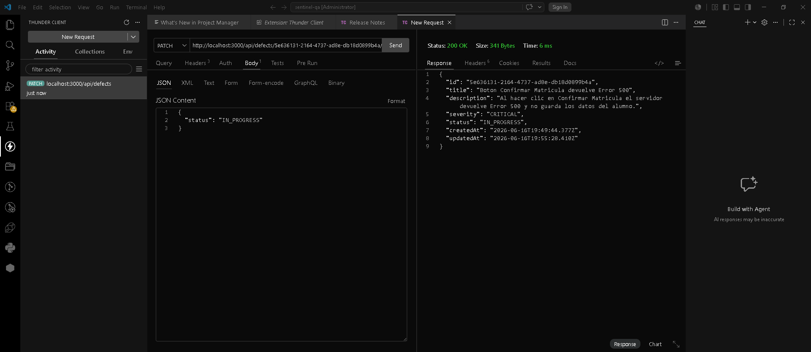
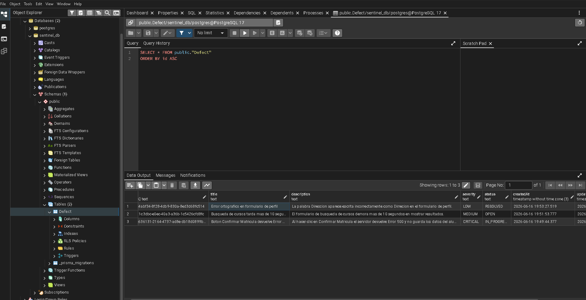

# Sentinel QA — Bug & Defect Tracker
### Prueba de Calidad del Software · Semana 09
**DSI V Ciclo · Turno Noche**

---

## Evidencia del Laboratorio

### Captura 1 — Petición PATCH exitosa (Thunder Client)

### Captura 2 — Petición PATCH exitosa (Thunder Client)

### Captura 3 — Tabla Defect en pgAdmin

